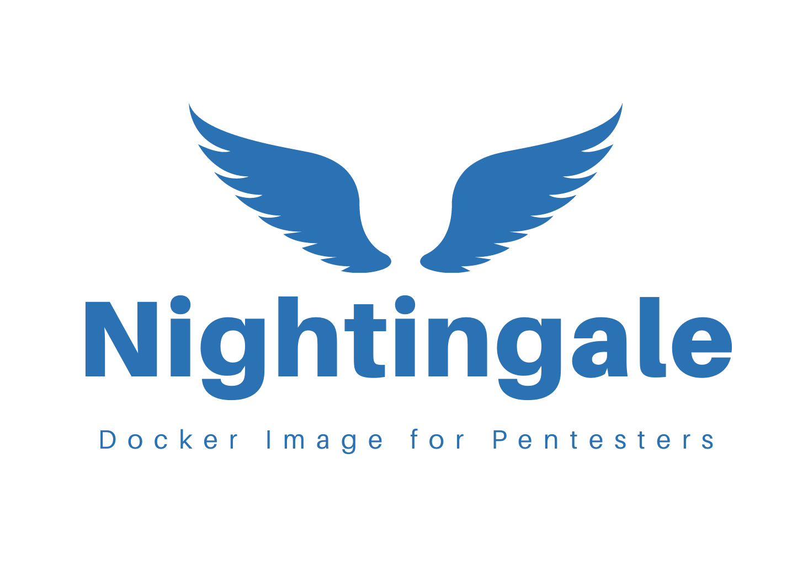

---

layout: col-sidebar
title: OWASP Nightingale
tags: Nightingale
altfooter: true
level: 2
site_side: true

---

Welcome to the Nightingale documentation! This guide will provide you with all the information you need to install and set up Nightingale, a powerful open-source tool that utilizes the power of Docker to provide a ready-to-use environment for penetration testing.

### Why Nightingale?

Penetration testing plays a vital role in safeguarding an organization’s IT infrastructure. However, setting up a testing environment is often a time-intensive and complex process, requiring the installation of multiple tools, frameworks, and programming languages. Ensuring consistency across different environments can also pose significant challenges, making it difficult for organizations to effectively identify and address vulnerabilities.

How Nightingale Simplifies Penetration Testing

Nightingale is an open-source solution designed to overcome these challenges by offering a pre-configured, ready-to-use environment for penetration testers. Built on top of Docker, Nightingale streamlines the setup process, eliminating the need to manually install and configure programming languages and modules.